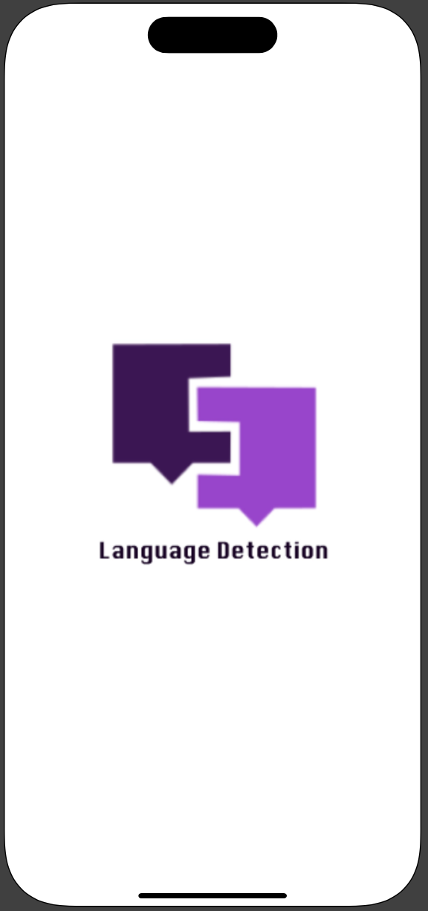
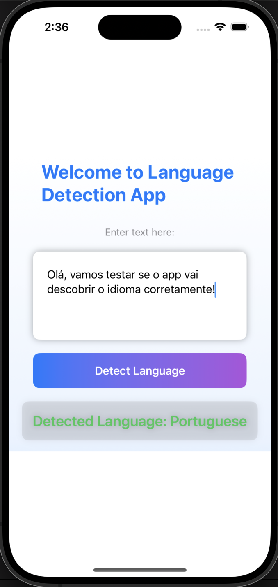

# LanguageDetectionApp 🚀📱

A modern SwiftUI iOS application that detects the language of user input using Apple's Natural Language framework. With a simple and intuitive interface, LanguageDetectionApp provides a seamless experience for detecting the dominant language of any text entered by the user.

## 🌟 Features

- **SwiftUI Integration**: Built using the latest SwiftUI framework for smooth and responsive UI.
- **Natural Language Processing**: Utilizes Apple's Natural Language framework to determine the language of any given text.
- **Beautiful Gradient Design**: The app features a visually appealing gradient background and modern UI components.
- **Real-Time Language Detection**: Get instant feedback on the detected language as you type.

## 📸 Screenshots

Here are some images demonstrating the functionality of the LanguageDetectionApp:

### Splash Screen


### Main Screen


## 🛠️ Technologies Used

- **SwiftUI**: A declarative framework for building modern iOS user interfaces.
- **NaturalLanguage Framework**: A powerful toolkit for processing natural languages and detecting the dominant language.

## 🚀 Getting Started

1. Clone the repository:
   ```bash
   git clone https://github.com/cmontilha/LanguageDetectionApp.git
   ```
2. Open the project in Xcode:
   ```
   open LanguageDetectionApp.xcodeproj
   ```
3. Connect your iPhone to your Mac and select it as the deployment target.
4. Press the **Run** button (or `Cmd + R`) to install and run the app on your device.

## 📋 Requirements

- iOS 15.0+
- Xcode 13+

## 💡 How It Works

1. **Splash Screen**: The app launches with a splash screen featuring the logo of the app.
2. **Input Text**: The user enters text in the text editor field.
3. **Language Detection**: When the user taps the **Detect Language** button, the app uses Apple's NaturalLanguage framework to determine and display the language of the text.

## 📝 License

LanguageDetectionApp is available under the MIT License.

## 🤝 Contributing

Contributions are welcome! Feel free to open an issue or submit a pull request with improvements or bug fixes.

---

Thank you for using **LanguageDetectionApp**! 
